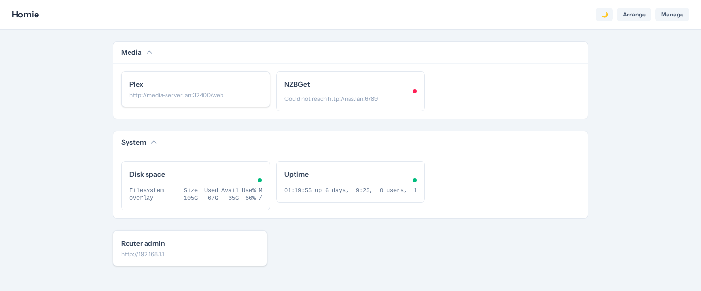
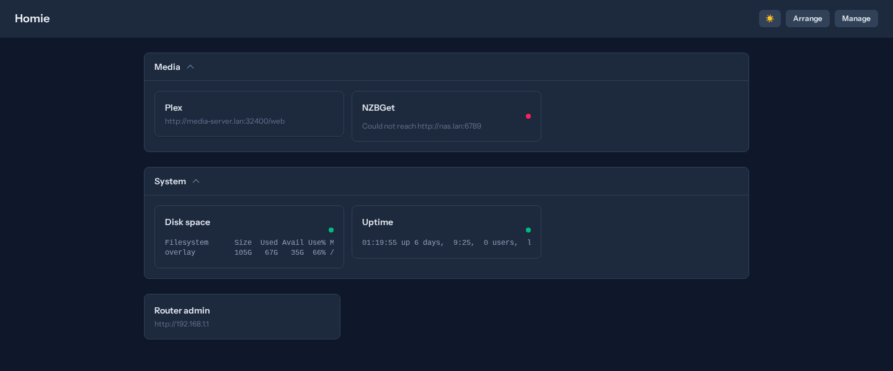

# Homie

[](https://github.com/loki495/homie/actions/workflows/ci.yml)

A self-hosted, configurable homepage/dashboard for home lab services — cards for each
service or module, grouped and reorderable, with live output widgets (CPU/mem/disk,
custom commands) and optional API integrations for common self-hosted apps (the *arr
stack, nzbget, etc).

Built to be **distributable**: no service, machine, or credential is hardcoded anywhere
in the app. Everything — services, machine targets, output-card commands, API
connections, card order, and groups — is user-configured data, not code.

## Screenshots

| Light | Dark |
| --- | --- |
|  |  |

Shown with a small set of sample cards (`php artisan db:seed --class=DemoDashboardSeeder`) — a
real dashboard fills in with whatever services you configure.

## Stack

- Laravel 13
- Livewire 4 (single-file components) + Alpine.js (bundled with Livewire)
- Tailwind CSS v4 (via `@tailwindcss/vite`)
- Flux UI (free tier) for form/button components
- SQLite
- Docker + Traefik for local development

## Features

- Service cards that open the linked site on click, each with an optional icon — paste
  any image URL, or search recognized self-hosted apps (sonarr, plex, etc.) against the
  free homarr-labs/dashboard-icons index for a one-click suggestion
- Docker service discovery: save a scan target (name + host) in Settings, run a manual
  scan against its Docker Engine API (or `docker ps` over SSH), and turn discovered
  containers into cards. Prefers a container's Traefik `Host()` label for the URL when
  present, so services with no host-published port are still discovered correctly.
  Falls back to the image's declared `EXPOSE` port for `--network host` containers,
  which never show a port mapping otherwise — and still surfaces them with a bare host
  URL (no port) when the image declares none at all, rather than dropping them
- Manual custom links for anything discovery doesn't cover
- Editable "output" cards: user-defined shell commands (local or remote, e.g. via SSH),
  run non-blockingly on each page load, rendering raw output (disk space, load, etc.).
  If a command SSHes into a saved machine, that machine needs a key saved in Settings
  first — saving one auto-syncs it to `storage/ssh/{machine-name}` for the command to
  use (e.g. `-i /var/www/html/storage/ssh/media`); commands referencing a machine with
  no saved key will fail with a permission-denied error
- API-connected cards for services with an API — Sonarr and Radarr show series/movies,
  missing, and queue counts; Prowlarr shows enabled indexers, grabs, and failures;
  Bazarr shows missing subtitle counts; NZBGet shows download speed, status, and
  remaining size. API key or username/password auth, whichever the service needs.
  Clicking the card opens the service, same as a link card. A generic fallback covers
  any other API with a plain reachability check
- Drag-and-drop reordering for both cards and groups in Arrange mode (native HTML5 drag,
  batched into a single save on drop). Up/down arrow buttons remain alongside it as a
  fallback, since native HTML5 drag doesn't work on touch devices
- Expandable/collapsible groups ("folders") of cards
- Backup: export the whole config (groups, cards, scan targets) as one JSON file, and
  restore from it later or on a new box. API keys, passwords, and SSH private keys are
  never included in the export — re-enter those after a restore. Importing replaces
  everything currently configured, it doesn't merge

## Major implementation decisions

- **Discovery prefers a container's Traefik label over its published port.** An earlier
  version required a host-published port even when a Traefik `Host()` label was present,
  which silently dropped every container only reachable through Traefik's internal
  Docker-network routing — the common case when only the reverse proxy itself publishes
  ports. Label-first ordering is now load-bearing; see `app/Support/Discovery/MachineDiscovery`.
- **Host-network containers get an `EXPOSE`-port fallback, not a dropped result.**
  `docker ps`/`/containers/json` report empty ports for `--network host` containers, so a
  real scan was silently missing things like Home Assistant and ESPHome. Discovery now
  falls back to the image's declared `EXPOSE` port, and — for images that declare none —
  still surfaces the container with a bare host URL rather than dropping it. A hardcoded
  per-image default port was considered and rejected as exactly the kind of
  lab-specific special-casing this project's distributability rule forbids.
- **Config export never includes secrets.** Backup/restore (`app/Support/Config/ConfigExporter`
  and `ConfigImporter`) walks the whole config into one JSON file, but API keys, passwords,
  and SSH private keys are replaced with a boolean (`has_api_key`, etc.) rather than
  exported — a JSON backup is far more likely to end up copied or committed somewhere
  by accident than the SQLite file it's backing up.
- **Card icon/name render eagerly; only fetched content is lazy-loaded.** Output/API cards
  are lazy-loaded Livewire components so a slow shell command or HTTP call doesn't block
  first paint — but the icon and name are plain, already-loaded `Card` attributes, so they
  moved out into an eagerly-rendered Blade partial instead of sitting behind the same
  lazy boundary as the fetch itself.

## Local development

Requires Docker. The `web` Docker network referenced in `docker-compose.yml` is
optional — it only matters if you also run a Traefik instance and want nicer
hostnames; without it, the app is reachable directly via a published port.

```bash
docker compose up -d --build
docker compose run --rm vite npm install   # first time only
npm run build                              # or `docker compose run --rm vite npm run build`
```

Site: http://localhost:8090 (override the host port with `APP_PORT` in `.env` if
8090 collides with something else already running)

If you also run Traefik with a `web` external network and your own DNS/hosts
routing to it, you can additionally reach the app and the Vite dev server (HMR)
at whatever hostnames you configure — see the `traefik.*` labels in
`docker-compose.yml`. That routing lives entirely in your own Traefik config;
nothing in this repo assumes or ships one.

An optional Cloudflare Tunnel deployment can expose the dashboard at the
`APP_URL` hostname. Set `STATIC_ASSET_HOSTS` to the externally exposed hostname
so remote requests use the built Vite assets instead of exposing the
development server. Run `npm run build` after frontend changes intended for
remote access.

`.env.example` ships with `APP_DEBUG=false` — flip it to `true` locally if you want
Laravel's debug error pages while developing, but leave it off anywhere the dashboard
stays running day-to-day: this app has no login of any kind, so a debug page (full
stack trace, file paths, query bindings) would be visible to anyone who can reach it.

### Testing and code quality

Run from the host — these wrap `docker exec` into the `homie-app` container:

```bash
composer pest         # run the test suite (Pest)
composer pest:browser # real-browser smoke tests (Pest + Playwright, separate image)
composer pint         # code style (auto-fix)
composer phpstan      # static analysis (level 6)
composer rector       # modernization suggestions (dry-run only)
composer rector:apply # apply rector changes (review the diff first)
```

`pest:browser` runs in its own `app-test` Docker service (`docker compose --profile
test ...`) rather than in `homie-app` — it needs Node.js and a Chromium binary that
have no business being baked into the same image that also serves production over the
tunnel. It builds on first run (~1–2 minutes, mostly downloading Chromium); after that
it's fast. GitHub Actions runs all three suites — Pest, the frontend build, and the
browser suite — on every push to `main` and every pull request; see
`.github/workflows/ci.yml`.

### Ownership note

Commands that write files inside the container should run as `www-data` (UID 1000,
matching the host user) to avoid root-owned files on the bind mount:

```bash
docker exec -u www-data homie-app <command>
```

The composer script wrappers above already do this. If you run `docker exec` directly
as root and end up with permission errors editing files afterward, fix ownership with:

```bash
docker exec -u root homie-app chown -R 1000:1000 /var/www/html
```

## Current limitations

- No authentication of any kind — access control is entirely "don't expose this to
  the internet without a login of your own in front of it" (see the `APP_DEBUG` note
  above). Not suitable for anything but a LAN or an authenticated reverse-proxy setup.
- Docker discovery only understands the Docker Engine API and `docker ps` over SSH —
  no Kubernetes, Podman, or other container runtimes.
- Output cards run whatever shell command you configure with no sandboxing beyond
  the container it runs in; treat this the same as you would any other tool that
  runs arbitrary shell commands you wrote yourself.
- API integrations cover the *arr stack (Sonarr/Radarr/Prowlarr/Bazarr) and NZBGet —
  anything else falls back to a plain reachability check, not real stats.

## Git workflow

Single-branch: `main`. This project doesn't use the master/local split — work happens
directly on `main`.
